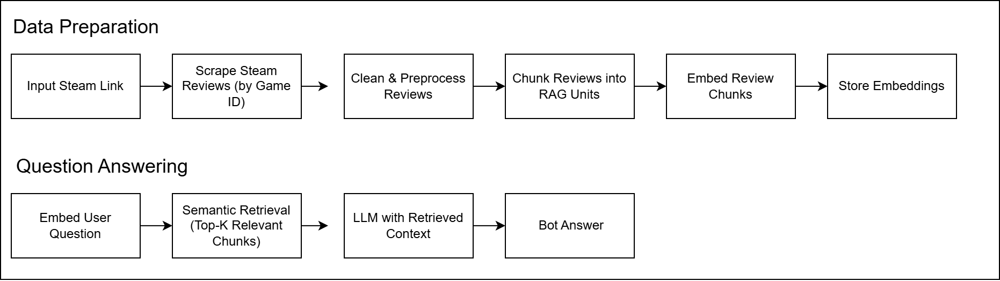
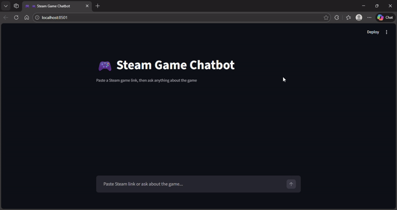

# Steam Game Review Analysis using Retrieval-Augmented Generation (RAG)

A question-answering system that analyzes Steam game reviews using semantic retrieval and large language models.

---

## 📌 Quick Overview

This project builds a question-answering system based on Steam game reviews using
Retrieval-Augmented Generation (RAG). Users provide a Steam game link or App ID as input,
which triggers the system to:

- Scrape recent Steam reviews and factual game data (genre, player modes, description)
- Retrieve the most relevant review context based on semantic similarity
- Generate answers strictly from retrieved data, not from the model’s general knowledge
---

## Project Objectives

Steam games often receive thousands of user reviews, making it difficult for players
to quickly understand whether a game is recommended or not, especially when opinions
are mixed and spread across long review texts.

This project was built to help users:
- Gain a high-level understanding of whether a game is worth playing or purchasing
- Explore detailed player opinions without reading hundreds of individual Steam reviews
- Ask natural language questions to uncover strengths, weaknesses, and recurring issues
- Understand *why* players recommend or criticize a game, not just whether they do

Instead of blindly summarizing reviews, the system answers questions solely based on
retrieved user reviews, ensuring that insights remain grounded in actual player experiences.

---

## Tools

- **Programming Language:** Python
- **Web Interface:** Streamlit
- **Data Collection:** Steam Reviews Scraper (Steam Web API / scraping library)
- **Embedding Model:** SentenceTransformer (`text-embedding-3-small`)
- **Vector Search:** Cosine similarity–based semantic retrieval
- **LLM:** GPT-5-nano (used for answer generation)
- **Frameworks & Libraries:** pandas, numpy, scikit-learn, sentence-transformers

---

## 📂 Dataset

**Source:**
- Steam user reviews (scraped directly from Steam)

**Details:**
- Number of reviews: 1000
- Language: English
- Data type: Unstructured text (user-generated reviews)

The dataset is collected dynamically using a Steam App ID, allowing the system to be
applied to different games without retraining the model.

---

## System Flow

---

## Data Preprocessing

The preprocessing step normalizes and cleans raw Steam reviews by removing URLs,
HTML tags, emojis, and noisy characters, converting text to lowercase, and filtering
out overly short or non-informative reviews. This ensures that the remaining reviews
are semantically meaningful and suitable for embedding, retrieval, and grounded
question answering.

---

## Feature Engineering

Instead of traditional numerical features, this project uses:
- Text chunking (1 review ≈ 1 chunk)
- Sentence embeddings for semantic representation
- Lightweight metadata (review content)

---

## Model Development

### 1. Embedding Model
- SentenceTransformer (`text-embedding-3-small`)

### 2. Retrieval
- Vector similarity search using cosine similarity
- Top-k most relevant review chunks are used as context

### 3. Generation
- Large Language Model (LLM)

The prompt is strictly constrained so that:
- The model only uses retrieved reviews as context
- No external or general knowledge is allowed
- The model is not fine-tuned; performance relies on retrieval quality and prompt discipline

--- 

## Conclusion

This project demonstrates that the Retrieval-Augmented Generation (RAG) approach is
effective for analyzing player opinions based on real Steam review data, without
requiring labeled training data or model fine-tuning.

By restricting answer generation to semantically retrieved reviews, the system is able to:
- Reduce hallucinations in large language models
- Produce grounded answers that can be traced back to review sources
- Handle open-ended, qualitative, and exploratory questions

Rather than relying on traditional quantitative sentiment scoring, the project emphasizes
context-based interpretation, allowing users to understand *why* certain opinions emerge,
not just whether they are positive or negative.

Overall, the system is modular, reusable, and scalable, as it can be applied to different
games simply by changing the Steam App ID, without retraining the model.

---

## Chatbot Preview 

## License

This project is licensed under the MIT License.

---

## Contact

If you have any questions or feedback, feel free to reach out:
- **Email:** Ayusekar1822@gmail.com
- **LinkedIn:** https://www.linkedin.com/in/ayusekar22/
- **GitHub:** https://github.com/Ayusekar22
